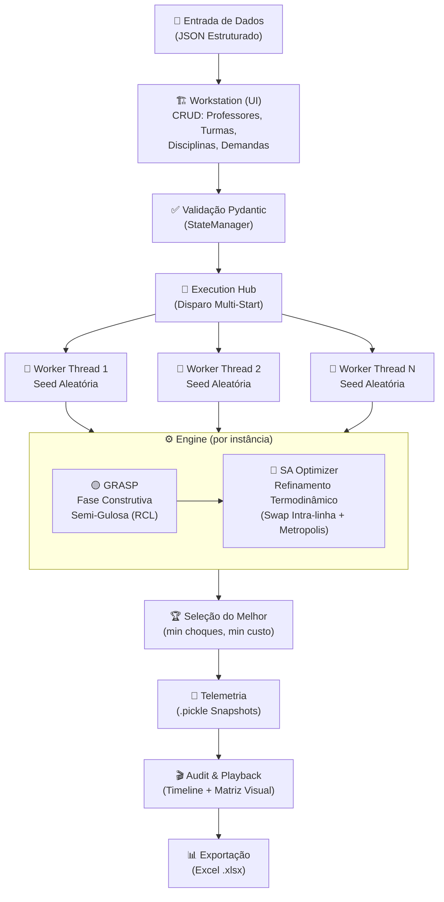
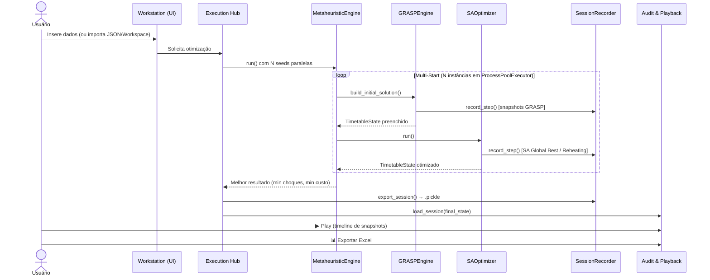
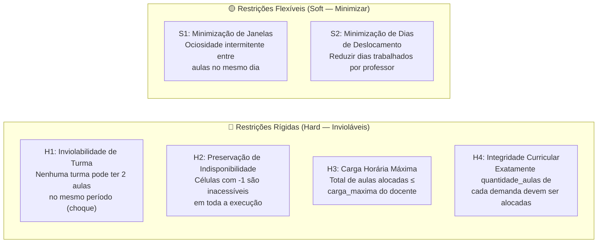
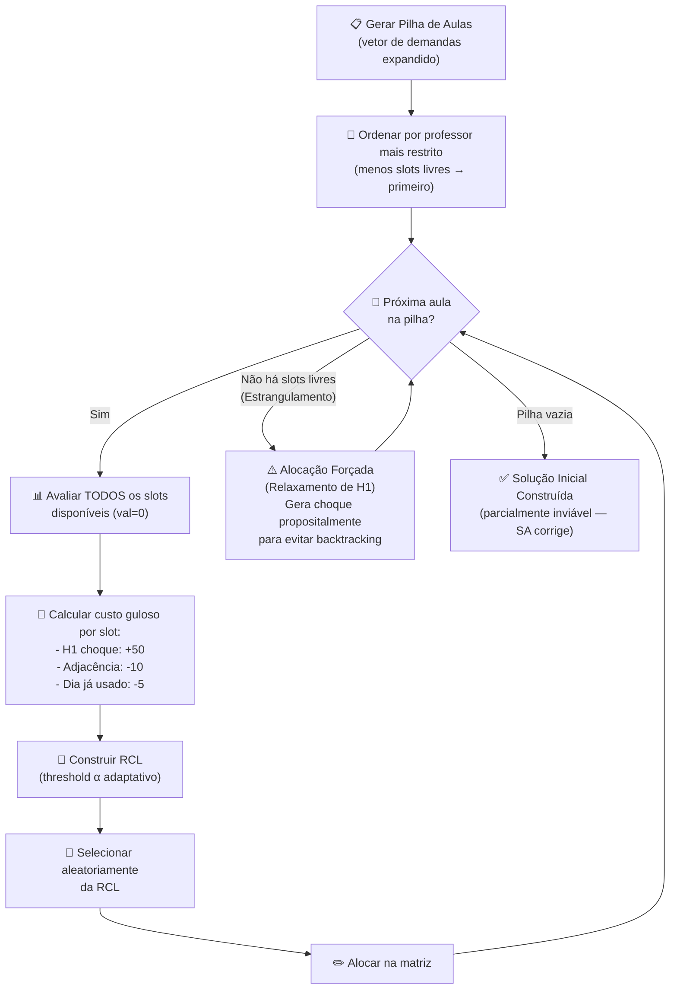
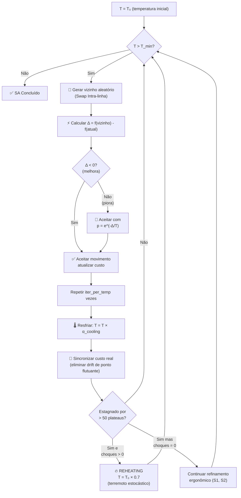
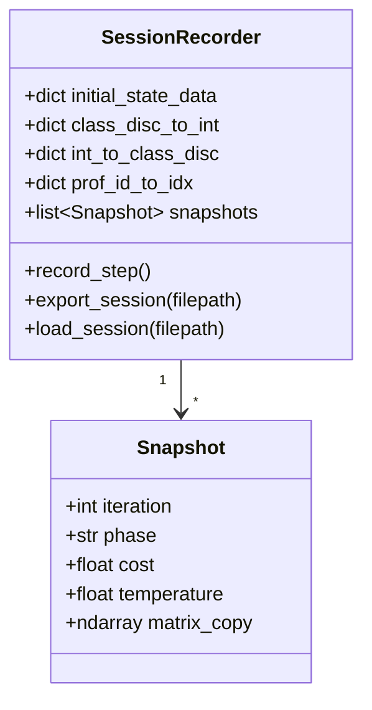

# Otimização Heurística de Quadro de Horários Escolares (STP)
### Hibridização GRASP + Simulated Annealing

> **Instituto Federal de Educação, Ciência e Tecnologia de Minas Gerais — IFMG**  
> Disciplina: Tópicos Especiais em Algoritmos  
> Autores: Allysson Bruno Chaves Assunção · Moisés Emanuel Reis da Cruz  
> Referências: Souza, Maculan e Ochi (2003) · Zhang, Liu e M'Hallah (2010)

---

## Índice

1. [Contexto e Problema](#1-contexto-e-problema)
2. [Arquitetura Híbrida da Solução](#2-arquitetura-híbrida-da-solução)
3. [Estrutura do Projeto](#3-estrutura-do-projeto)
4. [Instalação e Execução](#4-instalação-e-execução)
5. [Representação da Solução — Matriz X(M×P)](#5-representação-da-solução--matriz-xmp)
6. [Modelagem de Restrições e Função Objetivo](#6-modelagem-de-restrições-e-função-objetivo)
7. [Fase 1: Motor Construtivo (GRASP)](#7-fase-1-motor-construtivo-grasp)
8. [Fase 2: Refinamento Termodinâmico (Simulated Annealing)](#8-fase-2-refinamento-termodinâmico-simulated-annealing)
9. [Orquestração Multi-Start Paralela](#9-orquestração-multi-start-paralela)
10. [Telemetria e Serialização (Pickle)](#10-telemetria-e-serialização-pickle)
11. [Interface Gráfica (PyQt6)](#11-interface-gráfica-pyqt6)
12. [Auditoria, Playback e Exportação](#12-auditoria-playback-e-exportação)
13. [Validação Headless (Modo Acadêmico)](#13-validação-headless-modo-acadêmico)
14. [Datasets Sintéticos de Benchmark](#14-datasets-sintéticos-de-benchmark)
15. [Referências Bibliográficas](#15-referências-bibliográficas)

---

## 1. Contexto e Problema

O **School Timetabling Problem (STP)** é o problema de alocar recursos acadêmicos — docentes, turmas e espaços físicos — em blocos temporais restritos, respeitando um conjunto de restrições operacionais e maximizando a qualidade ergonômica da grade resultante.

### 1.1 Complexidade Computacional

O STP é classificado categoricamente como **NP-difícil (NP-hard)**. O espaço de soluções cresce fatorialmente com o número de turmas e docentes, tornando inviável a aplicação de métodos exatos para instâncias reais. Este fenômeno é denominado **explosão combinatória**.

> Em instâncias realistas (50 professores × 25 períodos), o espaço de busca supera 10⁶⁴ configurações possíveis.

Nesse cenário, as **meta-heurísticas** consolidam-se como a única alternativa viável para a obtenção de soluções de alta qualidade em tempo computacional razoável.

### 1.2 Dicotomia Metodológica da Literatura

| Aspecto            | Souza et al. (2003)           | Zhang et al. (2010)                  |
|--------------------|-------------------------------|--------------------------------------|
| **Perspectiva**    | Professor-cêntrica            | Turma-cêntrica                       |
| **Representação**  | Matriz 2D `X(M×P)`            | Hiper-matriz 3D `M(c, d, p)`        |
| **Meta-heurística**| GRASP + Tabu Search           | Simulated Annealing bifásico         |
| **Foco**           | Gerenciamento da carga docente| Visão holística da grade discente    |

**Nossa proposta hibridiza ambos os paradigmas:** adota a eficiência passiva da matriz docente 2D de Souza et al. para gerenciar conflitos, combinada com o motor termodinâmico do SA de Zhang et al. para otimização global.

---

## 2. Arquitetura Híbrida da Solução



### 2.1 Ciclo de Vida de uma Execução



---

## 3. Estrutura do Projeto

```
timetable-solution-metaheuristic/
│
├── main.py                     # Ponto de entrada da aplicação PyQt6
├── requirements.txt            # Dependências do projeto
├── constrained.json            # Dataset benchmark: alta densidade (50 profs, 30 turmas)
├── standard.json               # Dataset benchmark: densidade média
├── loose.json                  # Dataset benchmark: baixa densidade
│
├── src/
│   ├── core/
│   │   ├── state.py            # TimetableState: Matriz X(M×P) + mapeamentos O(1)
│   │   ├── evaluator.py        # STPEvaluator: custo total e Delta Cost O(P)
│   │   └── telemetry.py        # SessionRecorder: Snapshot + serialização Pickle
│   │
│   ├── engine/
│   │   ├── grasp.py            # GRASPEngine: fase construtiva semi-gulosa (RCL)
│   │   ├── sa_optimizer.py     # SimulatedAnnealingEngine: Metropolis + Reheating
│   │   └── metaheuristic.py    # MetaheuristicEngine: orquestrador Multi-Start paralelo
│   │
│   ├── models/
│   │   ├── stp_state.py        # Modelos Pydantic (STPState, Demanda, Professor)
│   │   ├── state_manager.py    # StateManager: validações reativas (Qt Signals)
│   │   └── validators.py       # Regras de validação de integridade referencial
│   │
│   ├── views/
│   │   ├── ui_main.py          # UIMainWindow: janela principal com 3 abas top-level
│   │   ├── workers.py          # EngineWorker: QThread para execução não-bloqueante
│   │   └── crud/
│   │       ├── tab_workspace.py    # Importar/Exportar Workspace
│   │       ├── tab_parameters.py   # Configurar pesos (α, β, γ) e hiperparâmetros SA
│   │       ├── tab_disciplines.py  # CRUD de Disciplinas
│   │       ├── tab_classes.py      # CRUD de Turmas
│   │       ├── tab_professors.py   # CRUD de Professores e Indisponibilidades
│   │       ├── tab_demands.py      # CRUD de Demandas (H3, H4)
│   │       ├── tab_execution.py    # Hub de Execução Multi-Start
│   │       └── tab_playback.py     # Audit & Playback (timeline + exportação Excel)
│   │
│   └── utils/                  # Exportadores (JSON, Excel), persistência, gerador sintético
│
└── tests/
    ├── headless_validator.py   # Suite de auditoria acadêmica (sem UI, modo terminal)
    ├── test_grasp_engine.py    # Testes unitários da fase GRASP
    ├── test_sa_engine.py       # Testes unitários do SA Optimizer
    ├── test_playback_mock.py   # Testes de carregamento de sessão .pickle
    └── test_ui_mock.py         # Testes de integração UI (mock PyQt6)
```

---

## 4. Instalação e Execução

### 4.1 Pré-requisitos

- Python 3.11 ou superior
- `pip` ou `venv`

### 4.2 Instalação das Dependências

```bash
# Clone o repositório
git clone <url-do-repositório>
cd timetable-solution-metaheuristic

# Crie e ative o ambiente virtual
python -m venv .venv
source .venv/bin/activate  # Linux/macOS
# .venv\Scripts\activate   # Windows

# Instale as dependências
pip install -r requirements.txt
```

**Dependências principais (`requirements.txt`):**

| Biblioteca  | Finalidade                                           |
|-------------|------------------------------------------------------|
| `PyQt6`     | Framework de interface gráfica desktop               |
| `pydantic`  | Validação e serialização do modelo de dados (JSON)   |
| `numpy`     | Representação e manipulação da Matriz X(M×P)         |
| `pandas`    | Estruturação dos dados para exportação               |
| `openpyxl`  | Geração do arquivo Excel (.xlsx) final               |

### 4.3 Executar a Interface Gráfica (Modo Padrão)

```bash
python main.py
```

### 4.4 Executar o Validador Headless (Modo Acadêmico — Recomendado para Avaliação)

```bash
# Instale a dependência extra de visualização do terminal
pip install rich

# Execute o validador completo
python -m tests.headless_validator
```

> O validador roda o pipeline completo `GRASP → SA` no dataset `constrained.json` (50 professores, 30 turmas, 25 períodos) e executa asserções matemáticas formais em todas as restrições H1–H4. O exit code `0` indica aprovação total.

---

## 5. Representação da Solução — Matriz X(M×P)

### 5.1 Estrutura da Matriz

A grade horária é representada como uma **Matriz Bidimensional** `X(M×P)`:

- **Linhas (M):** Cada linha `i` representa um professor.
- **Colunas (P):** Cada coluna `j` representa um período letivo `(P = dias_letivos × períodos_por_dia)`.

```
         P0   P1   P2   P3   P4 | P5   P6   P7   P8   P9
         ← Segunda-feira →      | ← Terça-feira →
         ─────────────────────────────────────────────────
Prof M1 │  3 │  0 │  0 │  2 │ -1 │  1 │  0 │  3 │  0 │  2 │
Prof M2 │  0 │  5 │  0 │  0 │  0 │  0 │  4 │  0 │  5 │  0 │
Prof M3 │ -1 │ -1 │  1 │  0 │  6 │  0 │  0 │  1 │  0 │  6 │
         ─────────────────────────────────────────────────
```

**Domínio de cada célula `x[i][j]`:**

| Valor   | Semântica                                           | Implementação                          |
|---------|-----------------------------------------------------|----------------------------------------|
| `> 0`   | Aula alocada: código inteiro único da tupla `(Turma, Disciplina)` | `class_disc_to_int[(turma, disc)]`     |
| `0`     | Período vago (livre)                                | `np.full((M, P), 0, dtype=np.int32)`  |
| `-1`    | **Sentinela de Indisponibilidade** — célula inacessível | Preenchido em `O(1)` na inicialização |

### 5.2 Dicionário de Codificação (Mapeamento Bidirecional O(1))

Para compatibilidade com NumPy e eficiência computacional, a matriz armazena **inteiros** em vez de strings. O `TimetableState` mantém dois dicionários de tradução:

```python
# Encode: (turma, disciplina) → inteiro
self.class_disc_to_int: dict = {}   # ex: {("T101", "Matemática"): 1, ("T102", "Física"): 2}

# Decode: inteiro → (turma, disciplina)
self.int_to_class_disc: dict = {}   # ex: {1: ("T101", "Matemática"), 2: ("T102", "Física")}
```

**Construção em `O(D)` onde `D` = número de demandas únicas:**

```python
# src/core/state.py — TimetableState._build_encoding_map()
for d in self.stp_state.demandas:
    key = (d.id_turma, d.id_disciplina)
    if key not in self.class_disc_to_int:
        self.class_disc_to_int[key] = self.next_code
        self.int_to_class_disc[self.next_code] = key
        self.next_code += 1
```

A vantagem crítica: **qualquer lookup de decodificação durante a avaliação de restrições é `O(1)`**, eliminando comparações de string dentro dos loops internos do SA.

---

## 6. Modelagem de Restrições e Função Objetivo

### 6.1 Taxonomia de Restrições



**Estratégia de satisfação:**

| Restrição | Mecanismo de Satisfação                              |
|-----------|------------------------------------------------------|
| **H1**    | Penalização por peso `γ >> α > β` + SA Reheating     |
| **H2**    | **Satisfeita por construção** — sentinelas `-1` na inicialização da matriz |
| **H3**    | **Satisfeita por construção** — a Pilha de Aulas é gerada a partir do vetor de demandas (sem sobrealocação) |
| **H4**    | **Satisfeita por construção** — cada demanda gera exatamente `quantidade_aulas` eventos na Pilha |
| **S1**    | Função objetivo (minimização de `J`)                 |
| **S2**    | Função objetivo (minimização de `D`)                 |

### 6.2 Função Objetivo

$$f(X) = \alpha \cdot \sum_{i \in M} J_i(X) + \beta \cdot \sum_{i \in M} D_i(X) + \gamma \cdot \sum_{j \in P} C_j(X)$$

**Onde:**

| Variável   | Descrição                                                          |
|------------|--------------------------------------------------------------------|
| `J_i(X)`   | Contagem de **janelas** (períodos ociosos entre aulas) do professor `i` no dia |
| `D_i(X)`   | Contagem de **dias letivos trabalhados** pelo professor `i`        |
| `C_j(X)`   | Contagem de **choques de turma** no período `j` (violações de H1) |
| `α = 1.0`  | Peso das janelas — prioridade alta                                 |
| `β = 0.5`  | Peso dos dias de deslocamento — prioridade moderada                |
| `γ = 50`| **Penalidade consideravel** para choques — deve dominar toda a função   |

> **Invariante do projeto:** `γ >> α > β`. A hierarquia garante que o algoritmo nunca sacrifique a eliminação de um choque de turma para ganhar qualquer número de janelas.

**Implementação (`src/core/evaluator.py — calculate_total_cost`):**

```python
@staticmethod
def calculate_total_cost(matrix, alpha, beta, gamma, periodos, int_to_class_disc) -> float:
    J = STPEvaluator.evaluate_windows(matrix, periodos)      # S1
    D = STPEvaluator.evaluate_days(matrix, periodos)          # S2
    C = STPEvaluator.evaluate_clashes(matrix, int_to_class_disc)  # H1
    return (alpha * J) + (beta * D) + (gamma * C)
```

---

## 7. Fase 1: Motor Construtivo (GRASP)

### 7.1 Conceito

O **GRASP** (*Greedy Randomized Adaptive Search Procedure*) é responsável por construir uma solução inicial. A fase construtiva opera sobre a **Pilha de Aulas** — uma lista ordenada de eventos a alocar, gerada a partir do vetor de demandas do JSON.

A inserção não é puramente gulosa (determinística) nem puramente aleatória: utiliza a **Lista Restrita de Candidatos (RCL)** para explorar soluções diversificadas em cada reinicialização Multi-Start.

### 7.2 Fluxo do GRASP



### 7.3 Alpha Reativo (Adaptação Dinâmica da RCL)

O parâmetro `α` controla o grau de aleatoriedade da RCL:
- `α = 0`: seleção puramente gulosa (sempre a melhor opção).
- `α = 1`: seleção puramente aleatória.

A implementação utiliza um **alpha reativo** que se auto-ajusta conforme a dificuldade da alocação corrente:

**Pseudo-código:**
```
α_corrente = α_base (0.3)
Para cada aula na pilha:
    Se todos os candidatos têm custo ≥ 50 (todos com choque):
        α_corrente = min(1.0, α_corrente + 0.1)   // Mais aleatório → diversificação
    Senão:
        α_corrente = max(α_base, α_corrente - 0.05)  // Mais guloso → intensificação

    threshold = custo_min + α_corrente × (custo_max - custo_min)
    RCL = {slot | custo[slot] ≤ threshold}
    slot_escolhido = random.choice(RCL)
```

### 7.4 Alocação Forçada (Garantia da Integridade H4)

Se a matriz atingir um **estrangulamento** — nenhum slot vago (`val=0`) disponível para um professor — o GRASP executa o **fallback de alocação forçada**:

```python
# src/engine/grasp.py — GRASPEngine.build_initial_solution()
if not candidates:
    # Fallback: find ANY non-(-1) slot and force-allocate (generates clash by design)
    fallback = [col for col in range(...) if self.state.matrix[row, col] != -1]
    if fallback:
        chosen_col = random.choice(fallback)
        self.state.matrix[row, chosen_col] = code  # Overwrites — clash expected, SA will repair
```

> **Decisão de projeto:** O `backtracking` é deliberadamente evitado pois seu custo computacional é exponencial. A alocação forçada gera um choque de turma (violação de H1), mas delega a correção para o motor SA, que possui o mecanismo termodinâmico adequado para resolvê-la.

---

## 8. Fase 2: Refinamento Termodinâmico (Simulated Annealing)

### 8.1 Conceito

O **Simulated Annealing** é um algoritmo de busca local estocástico inspirado no processo físico de recozimento de metais. Recebe a solução inicial do GRASP (potencialmente inviável) e a refina iterativamente, até convergir para uma solução viável e ergonomicamente otimizada.

### 8.2 Operador de Vizinhança: Swap Intra-linha

O único movimento de perturbação do SA é o **Swap Intra-linha**: permuta de duas células `x[i][j1]` e `x[i][j2]` **na mesma linha `i`** (mesmo professor).

```
ANTES:  [T101/Mat] [  Vago  ] [ T102/Fís ] [  Vago  ] [T101/Mat]
                        ↕ SWAP(j=1, j=4)
DEPOIS: [T101/Mat] [T101/Mat] [ T102/Fís ] [  Vago  ] [  Vago  ]
```

**Invariâncias garantidas pelo Swap Intra-linha (por construção):**

| Invariante               | Explicação                                                      |
|--------------------------|-----------------------------------------------------------------|
| **H2 preservado**        | Células `-1` são explicitamente excluídas do swap               |
| **H3 preservado**        | O total de slots ocupados na linha não muda                     |
| **H4 preservado**        | Os mesmos códigos de `(turma, disciplina)` permanecem na linha  |
| **Sem conflito docente** | Dois professores nunca trocam aulas — impossível por definição  |

> Esta restrição do operador é o fundamento da eficiência do SA: **elimina toda necessidade de re-validar H2, H3, H4 a cada iteração**, focando o esforço computacional exclusivamente na eliminação de choques (H1) e na minimização de janelas (S1) e dias (S2).

### 8.3 Avaliação Delta — `O(P + M)` por Iteração

Em vez de recalcular `f(X)` sobre toda a matriz a cada iteração, o SA utiliza **avaliação incremental (Delta Cost)**:

**Pseudo-código do Delta Cost:**
```
ENTRADA: matriz, linha=i, colunas j1 e j2

ANTES do swap:
  old_J, old_D = avaliar_linha(matriz[i])           // O(P)
  old_C1 = avaliar_choques_coluna(matriz[:, j1])    // O(M)
  old_C2 = avaliar_choques_coluna(matriz[:, j2])    // O(M)
  old_custo_local = α·old_J + β·old_D + γ·(old_C1 + old_C2)

FAZER swap temporário: matriz[i,j1] ↔ matriz[i,j2]

DEPOIS do swap:
  new_J, new_D = avaliar_linha(matriz[i])           // O(P)
  new_C1 = avaliar_choques_coluna(matriz[:, j1])    // O(M)
  new_C2 = avaliar_choques_coluna(matriz[:, j2])    // O(M)
  new_custo_local = α·new_J + β·new_D + γ·(new_C1 + new_C2)

DESFAZER swap: matriz[i,j1] ↔ matriz[i,j2]

RETORNAR: delta = new_custo_local - old_custo_local
```

> **Complexidade:** `O(P + 2M)` por iteração, em vez de `O(M×P)` da avaliação completa. Em instâncias grandes, a avaliação delta é **20-50× mais rápida** que a avaliação global.

**Implementação (`src/core/evaluator.py — calculate_delta`):**

```python
@staticmethod
def calculate_delta(matrix, row, j1, j2, int_to_class_disc,
                    alpha, beta, gamma, periodos) -> float:
    # ANTES do Swap
    old_J, old_D = STPEvaluator.evaluate_row_ergonomics(matrix[row], periodos)
    old_C1 = STPEvaluator.evaluate_column_clashes(matrix[:, j1], int_to_class_disc)
    old_C2 = STPEvaluator.evaluate_column_clashes(matrix[:, j2], int_to_class_disc) if j1 != j2 else 0
    old_cost = (alpha * old_J) + (beta * old_D) + (gamma * (old_C1 + old_C2))

    # FAZ Swap (temporário)
    matrix[row, j1], matrix[row, j2] = matrix[row, j2], matrix[row, j1]

    # DEPOIS do Swap
    new_J, new_D = STPEvaluator.evaluate_row_ergonomics(matrix[row], periodos)
    new_C1 = STPEvaluator.evaluate_column_clashes(matrix[:, j1], int_to_class_disc)
    new_C2 = STPEvaluator.evaluate_column_clashes(matrix[:, j2], int_to_class_disc) if j1 != j2 else 0
    new_cost = (alpha * new_J) + (beta * new_D) + (gamma * (new_C1 + new_C2))

    # DESFAZ Swap
    matrix[row, j1], matrix[row, j2] = matrix[row, j2], matrix[row, j1]

    return float(new_cost - old_cost)
```

### 8.4 Loop Termodinâmico e Critério de Metropolis



### 8.5 Mecanismo de Reheating (Terremoto Estocástico)

O **Reheating** é ativado quando o algoritmo detecta **estagnação** (50 plateaus consecutivos sem melhoria global) **e ainda existem choques de turma** não resolvidos:

**Pseudo-código:**
```
stuck_counter = 0
max_stuck_plateaus = 50

Ao final de cada plateau:
  Se houve melhoria global: stuck_counter = 0
  Senão: stuck_counter += 1

  Se stuck_counter > max_stuck_plateaus:
    choques = avaliar_choques(matriz)
    Se choques > 0:
        T = T₀ × 0.7        // Injeta calor (não reinicia do zero)
        stuck_counter = 0   // Reseta contador
    Senão:
        // Sem choques: SA está lapidando ergonomia fina, não reaquece
        pass
```

> **Racionalidade:** O Reheating injeta calor suficiente para escapar de mínimos locais onde choques persistem, mas sem desperdiçar energia em soluções já viáveis (choques = 0). O fator `0.7×T₀` é calibrado para dar energia suficiente para resolver conflitos de turma sem desorganizar completamente a grade.

**Sincronização de Custo (TD-2 Fix):**

Após cada resfriamento, o custo acumulado via delta é **ressincronizado** com a avaliação completa para eliminar drift de ponto flutuante:

```python
# src/engine/sa_optimizer.py
current_temp *= self.alpha_cooling

# Recalculate true cost to eliminate floating point drift (TD-2)
current_cost = STPEvaluator.calculate_total_cost(
    matrix, self.alpha_peso, self.beta_peso, self.gamma_peso,
    self.periodos, self.state.int_to_class_disc
)
```

---

## 9. Orquestração Multi-Start Paralela

### 9.1 Conceito

O **Multi-Start** executa `N` instâncias independentes do pipeline `GRASP → SA`, cada uma com uma **seed aleatória diferente**, em paralelo usando `concurrent.futures.ProcessPoolExecutor`. A melhor solução (menor número de choques, desempate por menor custo ergonômico) é selecionada como vencedora.

### 9.2 Critério de Seleção do Vencedor

```python
# src/engine/metaheuristic.py — MetaheuristicEngine.run()
# Seleção lexicográfica: prioriza zero choques, depois menor custo total
if (choques, cost) < (best_choques, best_cost):
    best_choques = choques
    best_cost = cost
    best_matrix = matrix
    best_snapshots = snaps
```

> A comparação `(choques, cost)` é lexicográfica em Python, garantindo que **qualquer solução com menos choques vence**, independentemente do custo ergonômico.

### 9.3 Isolamento de Processos

Cada instância é executada em um **processo separado** (não thread), garantindo isolamento total de estado e aproveitamento real de múltiplos núcleos da CPU:

```python
with concurrent.futures.ProcessPoolExecutor(max_workers=N) as executor:
    futures = [executor.submit(_run_single_instance, stp_data, seed) for seed in seeds]
```

A função `_run_single_instance` recebe os dados serializáveis (`stp_data: dict`) e instancia todo o ambiente de execução internamente, evitando problemas de compartilhamento de estado entre processos.

---

## 10. Telemetria e Serialização (Pickle)

### 10.1 Estrutura do Snapshot



### 10.2 Fases de Snapshot Registradas

| Fase (`phase`)         | Quando é registrado                                      |
|------------------------|----------------------------------------------------------|
| `"GRASP Inicial"`      | Antes de qualquer alocação                               |
| `"GRASP Construindo"`  | A cada mudança de professor durante a construção         |
| `"GRASP Finalizado"`   | Após todas as aulas serem alocadas                       |
| `"SA Início"`          | Imediatamente antes do loop termodinâmico                |
| `"SA Global Best"`     | Toda vez que um novo mínimo global é encontrado          |
| `"SA Reheating"`       | Toda vez que o mecanismo de reaquecimento é ativado      |
| `"SA Fim Plateau"`     | Ao final de cada plateau com ao menos 1 aceitação        |
| `"SA Concluído"`       | Após o loop termodinâmico encerrar                       |

### 10.3 Formato de Exportação (`.pickle`)

```python
# src/core/telemetry.py — SessionRecorder.export_session()
pickle.dump({
    "initial_state_data": self.initial_state_data,    # Dados do JSON original
    "class_disc_to_int": self.class_disc_to_int,      # Mapa de codificação
    "int_to_class_disc": self.int_to_class_disc,      # Mapa de decodificação
    "prof_id_to_idx": self.prof_id_to_idx,            # Índice de linhas
    "snapshots": self.snapshots                        # Lista de Snapshot
}, f)
```

> Os arquivos `.pickle` são automaticamente salvos na pasta `telemetry_history/` após cada execução bem-sucedida, com prefixo `run_` e timestamp.

---

## 11. Interface Gráfica (PyQt6)

A aplicação é organizada em **3 abas top-level** (`QTabWidget`):

### 11.1 Aba 1: Workstation (I/O) ⚙️

Sidebar de navegação com 6 seções:

| Item da Sidebar         | Função                                                        |
|-------------------------|---------------------------------------------------------------|
| `Workspace (I/O) 🏠`    | Importar/Exportar workspace completo (`.json`)                |
| `Parâmetros`            | Configurar `α`, `β`, `γ`, `T₀`, `α_cooling`, `T_min`        |
| `Disciplinas`           | CRUD de disciplinas disponíveis                               |
| `Turmas`                | CRUD de turmas (classes)                                      |
| `Professores (H2)`      | CRUD de professores + configuração de indisponibilidades       |
| `Demandas (H3, H4)`     | CRUD de demandas curriculares (vínculo prof-turma-disciplina) |

> **[Inserir screenshot da aba Workstation — vista da sidebar e formulário de Professores]**

### 11.2 Aba 2: Execution Hub 🚀

Hub de disparo da otimização. Permite selecionar a fonte de dados:

- **Memória Atual** — dados inseridos na Workstation.
- **Benchmark Loose** — dataset sintético de baixa densidade.
- **Benchmark Standard** — dataset sintético de densidade média.
- **Benchmark Constrained** — dataset sintético de alta densidade (50 profs, 30 turmas).

A execução ocorre em `QThread` separada (`EngineWorker`) para não bloquear a UI. Um `QProgressDialog` informa o usuário durante o processamento.

> **[Inserir screenshot do Execution Hub — botão "🚀 Iniciar Otimização" em destaque]**

### 11.3 Aba 3: Audit & Playback 🎬

Após a execução (ou ao carregar um arquivo `.pickle`), esta aba apresenta:

- **HUD (Heads-Up Display):** Fase atual, número da iteração, temperatura e custo global.
- **Grade Matricial Visual:** A matriz `X(M×P)` renderizada com codificação por cores:
  - 🟦 **Turmas** — cada combinação `(turma, disciplina)` recebe uma cor única e estável via hash.
  - ⬛ **Indisponibilidade** — células `-1` renderizadas em cinza escuro com `"X"`.
  - ⬜ **Período Livre** — células `0` renderizadas em branco.
- **Timeline/Slider:** Navegar entre snapshots manualmente ou em modo `▶ Play` com velocidade ajustável (1×–100×).
- **Exportação Excel:** Gera arquivo `.xlsx` formatado com a grade final otimizada.

> **[Inserir screenshot da aba Audit & Playback — slider, HUD e grade colorida]**

---

## 12. Auditoria, Playback e Exportação

### 12.1 Fluxo de Auditoria Automática

Ao término de cada execução bem-sucedida, o `TabExecution.on_heuristic_finished()` executa automaticamente:

1. Serializa toda a sessão (snapshots + estado) em `telemetry_history/run_<timestamp>.pickle`.
2. Informa o caminho do arquivo ao usuário via `QMessageBox`.
3. Envia o `TimetableState` final para o `TabPlayback.load_session()`.
4. Navega automaticamente para a aba **Audit & Playback**.

### 12.2 Carregar Sessão Histórica

É possível carregar qualquer sessão anterior clicando em **"Carregar Sessão (.pickle)"** na aba Playback, sem necessidade de re-executar a otimização.

### 12.3 Exportação Excel

O botão **"📊 Exportar Excel (XLSX)"** ativa o `ExportManager`, que gera uma planilha formatada com a grade horária final do snapshot corrente.

---

## 13. Validação Headless (Modo Acadêmico)

O `headless_validator.py` é a **suíte de auditoria acadêmica** — executa o pipeline completo sem dependência da UI PyQt6 e aplica asserções matemáticas formais sobre o resultado.

### 13.1 Pipeline de Validação

```
Step 1/5: Carregamento do Dataset (constrained.json)
Step 2/5: Inicialização do TimetableState (pré-GRASP)
Step 3/5: Execução da fase GRASP
Step 4/5: Execução do SA (refinamento completo)
Step 5/5: Asserções Matemáticas H1–H4 + Profiler S1–S2
```

### 13.2 Asserções Matemáticas

| Constraint | Asserção Formal                                                         | Exit Code |
|------------|-------------------------------------------------------------------------|-----------|
| **H1**     | `∀j ∈ P: nenhuma turma aparece em mais de 1 linha simultaneamente`      | `FAIL` se violado |
| **H2**     | `∀ slot indisponível: matrix[row][col] == -1` após toda a execução      | `FAIL` se violado |
| **H3**     | `∀ professor i: Σ(matrix[i] > 0) ≤ carga_maxima[i]`                    | `FAIL` se violado |
| **H4**     | `∀ demanda (prof, turma, disc, qty): Σ(matrix[i] == code) == qty`       | `FAIL` se violado |

**Execução:**
```bash
# Certifique-se de estar na raiz do projeto com o .venv ativado
python -m tests.headless_validator

# Exit code 0 = PASS (todas as restrições rígidas satisfeitas)
# Exit code 1 = FAIL (violações detectadas — detalhes no terminal)
```

**Exemplo de saída esperada (PASS):**

```
╭──────────────────────────────────────────────────────╮
│  STP Headless Validator — Academic Audit Mode        │
│  GRASP + Simulated Annealing — Constraint Pipeline   │
╰──────────────────────────────────────────────────────╯

 Hard Constraint Assertion Report (H1–H4)
┌──────────────────────────────────────────────────┬────────────┬────────────┐
│ Constraint                                       │ Violations │ Status     │
├──────────────────────────────────────────────────┼────────────┼────────────┤
│ H1 — Class Clashes                               │     0      │ ✅ PASS    │
│ H2 — Unavailability Sentinels                    │     0      │ ✅ PASS    │
│ H3 — Workload Limits                             │     0      │ ✅ PASS    │
│ H4 — Curriculum Integrity                        │     0      │ ✅ PASS    │
└──────────────────────────────────────────────────┴────────────┴────────────┘

╭──────────────────────────────────────────────────────╮
│  ✅ ALL HARD CONSTRAINTS SATISFIED (H1–H4)           │
╰──────────────────────────────────────────────────────╯
```

---

## 14. Datasets Sintéticos de Benchmark

| Dataset            | Professores | Turmas | Períodos Totais | Densidade  |
|--------------------|-------------|--------|-----------------|------------|
| `loose.json`       | ~10         | ~8     | 25              | Baixa      |
| `standard.json`    | ~25         | ~15    | 25              | Média      |
| `constrained.json` | 50          | 30     | 25              | **Alta**   |

Os datasets são gerados pelo `SyntheticDataFactory` (disponível em `src/utils/synthetic_factory.py`) e pré-incluídos no repositório para reprodutibilidade dos benchmarks.

---

## 15. Referências Bibliográficas

- **SOUZA, M. J. F.; MACULAN, N.; OCHI, L. S.** (2003). *Um algoritmo GRASP-Tabu Search para o problema de alocação de professores a disciplinas*. Anais do XXXV SBPO.

- **ZHANG, D.; LIU, Y.; M'HALLAH, R.** (2010). *A simulated annealing with a new neighborhood structure based algorithm for high school timetabling problems*. European Journal of Operational Research, 203(3), 550-558.

---

<div align="center">

**Instituto Federal de Educação, Ciência e Tecnologia de Minas Gerais — IFMG**  
*Tópicos Especiais em Algoritmos · 2026*

</div>
